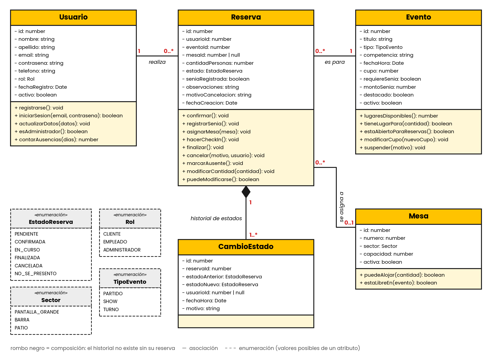
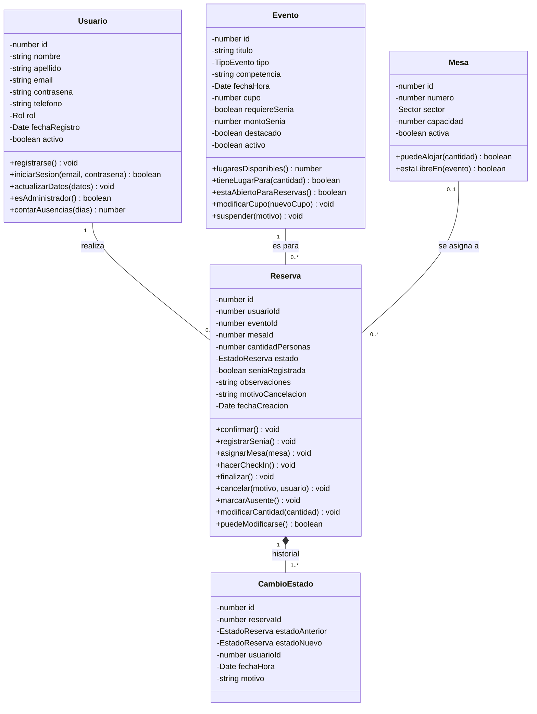

# CHS Burger: sistema de reservas

Sistema de reservas de mesas para partidos y eventos de **CHS Burger**.

Los clientes consultan la agenda de partidos y eventos del local, reservan una mesa y siguen el estado de su reserva. Los empleados registran señas, asignan mesas y hacen el check-in. El administrador carga los eventos y consulta reportes de ocupación.

> Estado actual: arquitectura MVC con un CRUD de **Eventos** con persistencia en memoria (arrays).

## Cómo ejecutarlo

```
cd Backend
npm install
npm start        # o npm run dev para reiniciar al guardar
```

El servidor escucha en `http://localhost:3000` (se puede cambiar con la variable `PORT`).

## Estructura del repositorio

```
├── Frontend/                 # interfaz web (todavía vacía)
├── Backend/
│   ├── package.json
│   └── src/
│       ├── server.js         # levanta el servidor
│       ├── app.js            # configura Express, rutas y middlewares
│       ├── routes/           # definición de endpoints
│       ├── controllers/      # reciben la petición y devuelven la respuesta
│       ├── services/         # reglas de negocio y validaciones
│       ├── repositories/     # acceso a los datos (arrays en memoria)
│       ├── models/           # clases del dominio
│       ├── middlewares/      # manejo centralizado de errores y rutas inexistentes
│       ├── responses/        # formato común de las respuestas
│       ├── exceptions/       # AppError y sus subclases
│       ├── enums/            # Messages, HttpStatus, TipoEvento, Sector, EstadoReserva, Rol
│       └── utils/            # validadores y parseo de IDs
├── diagrama-clases.png
└── README.md
```

## API de Eventos

| Método | Ruta | Descripción |
|---|---|---|
| GET | `/api/eventos` | Lista todos los eventos |
| GET | `/api/eventos/:id` | Obtiene un evento por ID |
| POST | `/api/eventos` | Crea un evento |
| PUT | `/api/eventos/:id` | Modifica un evento (solo los campos enviados) |
| DELETE | `/api/eventos/:id` | Elimina un evento |

Ejemplo de cuerpo para crear:

```json
{
    "titulo": "Racing vs. Independiente",
    "tipo": "PARTIDO",
    "competencia": "Liga Profesional",
    "fechaHora": "2026-11-01T19:00:00Z",
    "cupo": 70,
    "requiereSenia": true,
    "montoSenia": 4000
}
```

Respuesta exitosa: `{ "success": true, "data": { ... } }`. Respuesta con error: `{ "success": false, "message": "El evento no existe." }`.

## Modelo del dominio



| Clase | Qué representa |
|---|---|
| **Usuario** | Persona que usa el sistema. Su `rol` puede ser cliente, empleado o administrador. |
| **Evento** | Partido, show o turno común para el que se puede reservar. Tiene un cupo máximo de personas y puede requerir seña. |
| **Mesa** | Mesa del salón, con su sector (pantalla grande, barra o patio) y su capacidad. |
| **Reserva** | Reserva de un cliente para un evento. Es la entidad principal y recorre el flujo de estados. |
| **CambioEstado** | Historial de los cambios de estado de cada reserva: quién, cuándo y por qué. |

### Relaciones

- Un **Usuario** realiza muchas **Reservas** (1 a 0..*).
- Un **Evento** recibe muchas **Reservas** (1 a 0..*).
- Una **Mesa** se asigna a muchas **Reservas** a lo largo del tiempo; una reserva tiene como máximo una mesa (0..1 a 0..*).
- Una **Reserva** tiene uno o más **CambioEstado** (composición: el historial no existe sin su reserva).

### Flujo de estados de la Reserva

```
Pendiente → Confirmada → En curso → Finalizada
    ↘            ↘ ↘
   Cancelada   Cancelada / No se presentó
```

### Diagrama en Mermaid



> Los métodos del diagrama son una guía de lo que se va a implementar más adelante. Por ahora las clases de `Backend/src/models/` solo definen sus atributos; los valores posibles de `tipo`, `sector`, `estado` y `rol` están en `Backend/src/enums/`.
